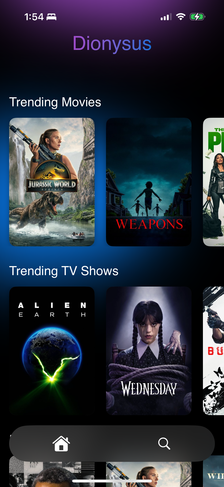

# Dionysus

A multi-platform media aggregation service for iOS and tvOS, built with SwiftUI. Dionysus connects to the TMDB and Real-Debrid APIs to provide a seamless browsing and library management experience.

---

## iOS & tvOS

---

## Features

* **Multi-Platform:** A shared codebase delivers a native experience on both iOS and tvOS, with a responsive UI tailored to each platform.

* **Dynamic Theming:** The user interface dynamically adapts its color theme based on the dominant colors extracted from the movie or TV show poster, creating a unique and immersive browsing experience for every piece of media.

* **Real-Debrid Integration:** Search for available sources and add them directly to your Real-Debrid account from within the app. The app also checks for existing torrents to prevent duplicates.

* **tvOS Top Shelf:** The tvOS app features a rich Top Shelf extension that showcases trending movies and shows, allowing users to get a preview or jump directly into the app from the home screen.

* **Advanced Search & Discovery:** Perform a global search for movies and TV shows or discover new content by browsing through genres.

* **Modern SwiftUI UI:** The interface is built entirely with SwiftUI, featuring smooth animations, shimmering loading states, and custom UI components.

* **Haptic Feedback:** The iOS app uses the CoreHaptics engine to provide subtle tactile feedback for a more satisfying and interactive user experience.
